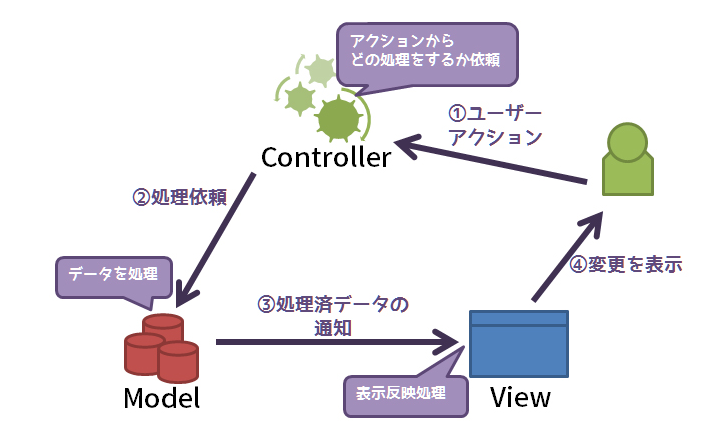
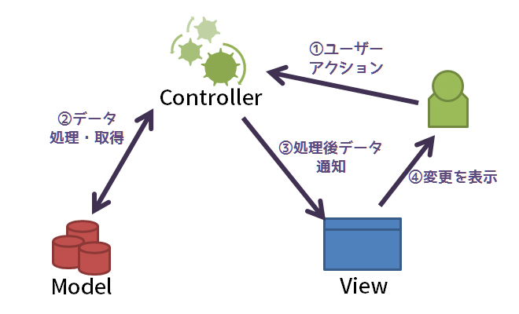
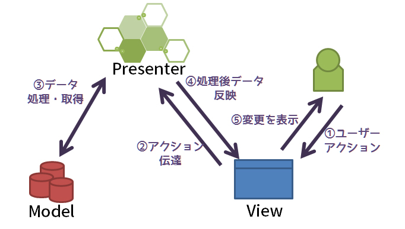
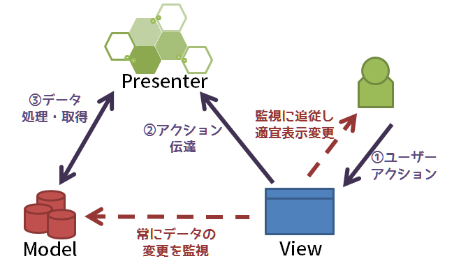

# 6月19日 勉強会

## MVC、本当にわかっていますか?
### 「V(View)」だけの場合
* HTMLにJavaScriptを書き直す必要がある
  + 最初は良いが、だんだん厳しくなってくる
  + プログラマが必ずしもデザインの専門家ではないからである
* デザインの変更は昨日に比べて頻繁に行われる
  + 座標軸のみの変更なら大丈夫だが、コードが絡んでくるこがある
* 結果厳しい。
### 「MV(Model,View)」の場合
* 例) チェックボタンが3つあるとする
  + 1,2 がチェック→ 画面A
  + 1,3 がチェック→ 画面B
  + それ以外→ Alert
* この場合MVどちらに処理を書けば良いか?
* 条件分岐の判断コードが増えてしまう
### 「MVC(Module,View,Controller)」
* 条件分岐などを置く場所としてControllerを用意する

参考：[MVC、本当にわかっていますか？（Qiita）](http://qiita.com/tshinsay/items/5b1724baf32b8b5113c2)

## Webアプリケーション開発者から見た、MVCとMVP、そしてMVVMの違い
### 定義としてのMVC
* M(Model)
  + そのアプリケーションが扱う領域データと手続きを表現する要素
  + データの変更をビューに通知するのもモデルの責任
* V(View)
  + モデルのデータを取り出して、ユーザが見るのに適した形で表示する要素。UIへの出力担当
  + 例えばWebアプリケーションではHTML文書を生成して動的にデータを表示するためのコードなど
  + GUIにおいては通常階層構造である。
* C(Controller)
  + ユーザからの入力（通常イベントとして通知される)をモデルへのメッセージへと変換してモデルに伝える要素。
  + UIからの入力を担当する。
  + モデルに変更を引き起こす場合もあるが直接に描画を行ったりモデルの内部データを直接操作したりはしない。

### 原初のMVC
* ビューとモデルが繋がっているところが違うところ。
* 元からあるMVCの場合はViewがユーザーのための表示にデータを加工したり
ユーザーの操作を補助したりと、Viewが肥大化する傾向にある
* ビューとモデルが密接に関係するので、双方の作業を分担しづらい。

### Model2のMVC
* ビューとモデルは直接繋がらずコントローラを介して両者が接続される。
* ビューとモデルは独立、基本的にビューとモデルはコントローラを介してやりとりをする。
* こちらのほうがWebアプリケーションのMVCに近い。
* 作業が分担しやすくなるが、Controllerの負担が大きい。

### 2つのMVC
* デスクトップアプリなどのアプリケーションでMVCという場合は原初のMVCを指すことが多い
* RailsなどのWebアプリケーションではModel2MVCを指すことが多い。

### MVP(Model,View,Presenter)
* Model2のMVCのModelとViewの結びつきをもっと疎にしたものがMVPである。
* パッシブビュー(Passive View)と監視コントローラ(Supervising Controller)の2つに別れる
* どちらにもある特性2つ
  + PresenterがViewへの参照を持ち、Modelが変更されたらViewを更新する
  + Viewはなるべく簡素なものとし、Presenterにて操作を行う。

### パッシブビュー
* ModelとViewが完全に分離され、Presenterがその仲介を果たす。
* Model2のMVCよりも、より分離するということが念頭にはおかれている。

### 監視コントローラ
* ViewがModelのデータに基づくUIを用意する場合ViewがModelのデータ情報を監視(Observe)し、Modelの状態に応じて表示を変更。
* データの変更に関してはViewから直にModelを操作せずPresenterを挟んでModelへのデータ変更の処理
* ユーザーアクションでViewが変わる場合はPresenterからViewに変更指示が行きますがModel起因のデータの場合はPresenterを挟まずにView側でデータを直接参照して
表示を行う

* モデル内のデータをそのまま表示させるような仕様の場合に効果を発揮
  + 監視しているModelの情報をView側でリスト表示
  + ユーザーがリスト表示させたデータを操作
  + 操作された内容をPresenterに通知
  + 操作された内容に基づき、PresenterがModel側へデータの更新を依頼
  + 依頼された内容に基づき、Model内のデータを更新
  + Model内の更新をView側の監視が察知し、リスト表示に反映
* 監視を挟むことにより、Presenterを経由せずともデータの反映を察知でき、またView側からModelを監視するのみなので、Viewからはデータ操作もできずPresenterからの操作のみという一貫性も担保できる。
* PresenterからViewへのデータ加工のコストが減るためその分Presenterの肥大化を和らげることができる。
* 原初のMVC同様にViewとModelの密度が上がるのでViewのデザインにModelが引っ張られる可能性がある。

参考：[Webアプリケーション開発者から見た、MVCとMVP、そしてMVVMの違い(Qiita)](http://qiita.com/shinkuFencer/items/f2651073fb71416b6cd7)

## MVCモデルの概念を漫画で解説してみる
* ユーザーインタフェースをもつアプリケーションソフトウェアの多くは、「MVC」モデルに基づいて設計されてる
* MVCでは、プログラムを、Model（モデル）、View（ビュー）、Controller（コントローラ）という3つの要素に分割し、お互いに呼び出し合って処理が実行されていく。

### 設定
* MVCモデルで設計された「なにかの申し込みシステム」があるとする
* 処理の内容は、なにかの申し込みをしたユーザ情報をデータベースに格納するだけ。

### 第1話 「なにかの申し込みシステムの日常」
* モデル、ビュー、コントローラは、お互いに協力し合いながら処理を行う。誰か1人でも欠けたら、このシステムは動かない。
* 3人が3人とも自分の仕事だけに集中し、他の人の仕事にはいっさい関与していないという点が大事
* ビュー
  + 受付業務を行います。申し込みボタンが押されたらコントローラーが勝手にやってきます。そしてコントローラに処理を依頼しますが、具体的な処理の内容は知りません。
* コントローラ
  + 処理を行います。処理の中に「データベースに格納せよ」という内容があったらモデルに依頼しますが、どのようにデータを格納しているのかは知りません。
* モデル
  + データを格納します。それまでコントローラがどのような処理をしたのかは知りません。もちろんビューがなにをしたかなど知るよしもありません。

### 第2話 「なにかの申し込みシステムの成長」
* ある日、なにかの申し込みシステムを作った開発者は、このシステムを改修したいと考えました。
* 改修ポイントは3つ
  + データベースを最適化して構造を変えたい
  + インターフェースをカッコよくしたい
  + 処理を追加したい
* 開発者は、モデル、ビュー、コントローラを別々に呼び出し、それぞれの改修ポイントをその人だけに伝えました。
* それぞれ仕様変更が発生したにも関わらず、まったく問題なく処理することができました。
* 重要なのは、仕様変更をそれぞれの人しか知らなくても問題ないという点です。
他の人の仕事にはいっさい関与しないので、他の人の仕様変更など関係ない。
* ビュー
  + おしゃれをしていますが、コントローラーはそんなことには気づきません。
* コントローラ
  + 仕事は増えましたが、他の人は知らんぷりです
* モデル
  + データベースの構造が変わりましたが、相変わらずコントローラはモデルに「これ、登録しといて」と言うだけ
* MVCモデルで設計しておくと、互いに仕様変更の影響を受けにくくて済むようになります。

### 第3話 「開発者の出世」
* 開発者は出世しデザイナー、プログラマー、データベースエンジニアという、3人の部下を持った。
* そしてまたある日、なにかの申し込みシステムを作った開発者は、このシステムをさらに改修したいと考えました。
* 改修ポイントは以前と同じ3つ
  + データベースをもっと最適化して構造を変えたい→データベースエンジニア
  + インターフェースのデザインをもっとカッコよくしたい→デザイナー
  + 処理をもっと追加したい→プログラマ
* MVCモデルで設計されていると、それぞれ分業が可能になる。

### まとめ
* Model（モデル）・・・データベースへのアクセス、SQLコマンドの送信、レコードの取得と管理。
* Controller（コントローラ）・・・プログラムの制御。
* View（ビュー）・・・画面の生成。テンプレート。

参考：[MVCモデルの概念を漫画で解説してみる](http://hijiriworld.com/web/mvc-concept/)

##
